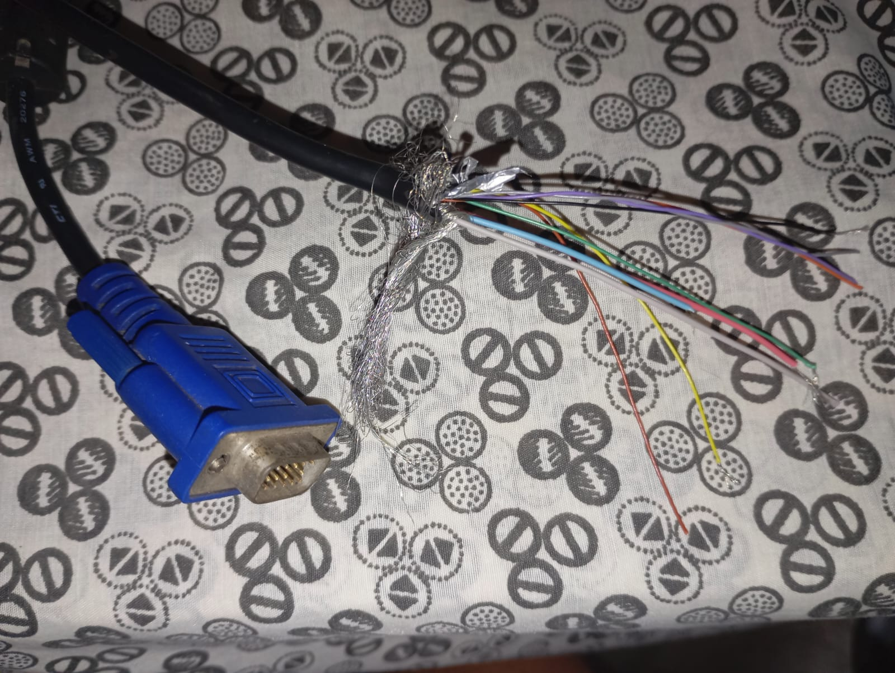
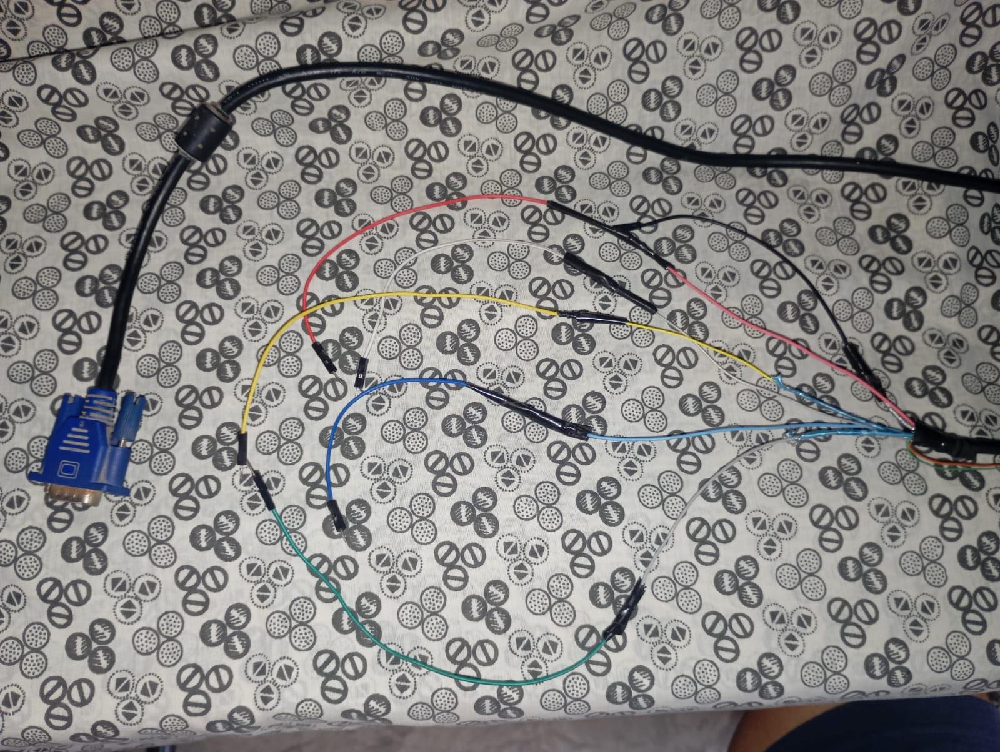
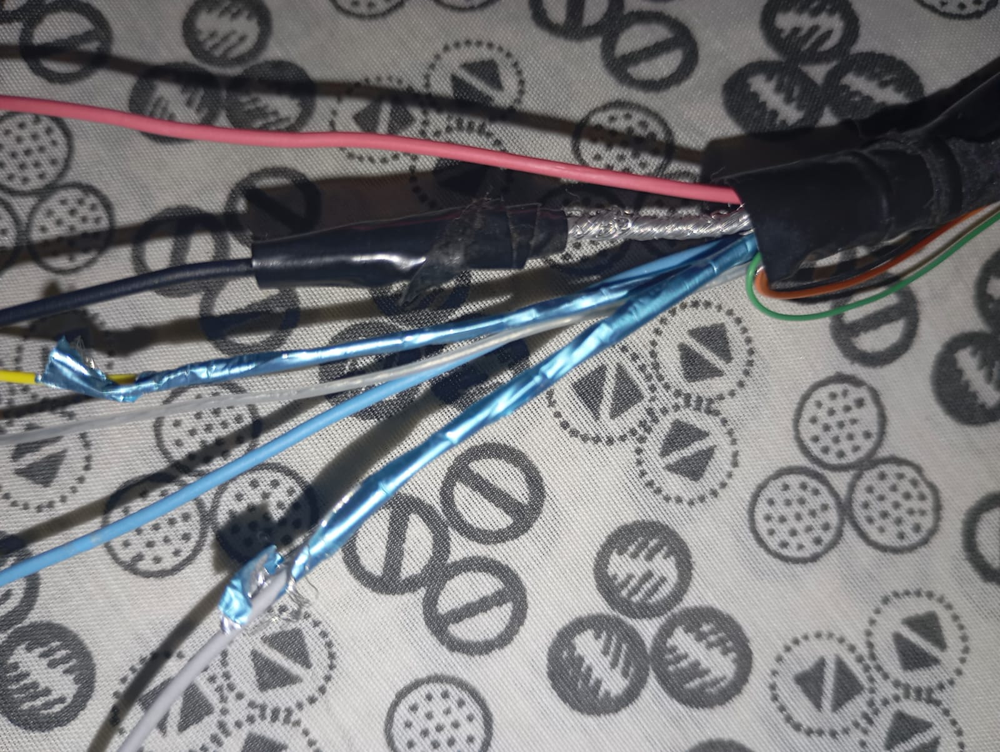
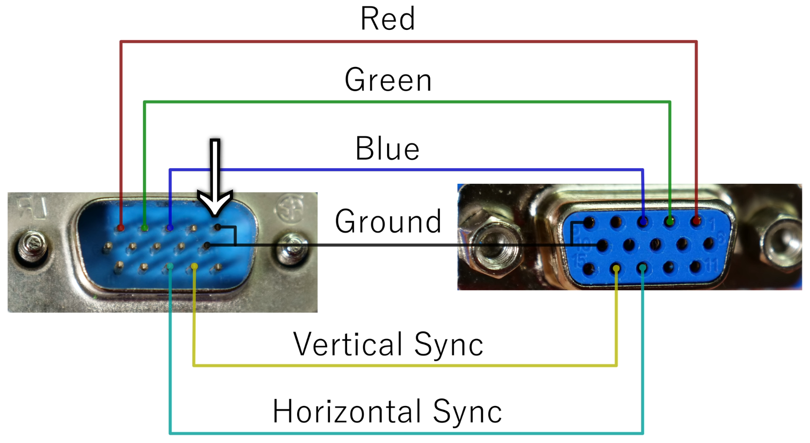
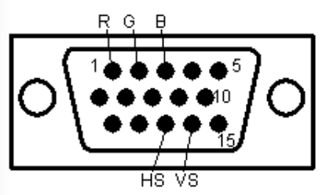

# 1. Introduccion

Este repositorio nace con el objetivo de aprender y comprender el uso de VGA en FPGA desde lo más básico hasta aplicaciones más avanzadas. 

La idea es comenzar entendiendo cómo se generan las señales de video y cómo el hardware controla lo que vemos en pantalla, para luego avanzar 
progresivamente hacia conceptos más complejos. Como meta final, se busca llegar a comprender cómo es posible realizar visualización y análisis en 
tiempo real utilizando un FPGA, conectando la teoría del diseño digital con aplicaciones prácticas y observables.

# 2. Conceptos previos

## 2.1 Cable VGA

### 2.1.1 Armado

##### 2.1.1.1 Cabecera

  

##### 2.1.1.2 Cables por fuera

  

##### 2.1.1.3 Cables ordenados y empalmados

  

##### 2.1.1.4 La tierra del cable

  

### 2.1.2 Reconocimiento

El VGA esta conformada por 5 pines importantes:

| Señal | Tipo | Descripción |
|--------|------|-------------|
| R (Rojo) | Video analógico | Define la intensidad del color rojo del píxel |
| G (Verde) | Video analógico | Define la intensidad del color verde del píxel |
| B (Azul) | Video analógico | Define la intensidad del color azul del píxel |
| HS (Sincronización Horizontal) | Digital | Sincroniza cada línea horizontal de la imagen |
| VS (Sincronización Vertical) | Digital | Sincroniza cada actualización completa de la pantalla |

Por ahoran no es importante saber que hace cada señal. 

Estos pines pueden ser ubicados de la siguiente manera:

  

o visto de otra manera:

  

### 2.1.3 Medición

Con el fin de poder tener cables que conecten directamente con los pines del VGA, mediremos la contiunidad de cables con ayuda de un
multímetro. Así podremos saber que cables corresponden a los pines de nuestro VGA.

Además, podremos corroborar que el material abundante que está sin protector que encontramos al pelar el cable, se trata de la tierra
del VGA. Midamos la continuidad entre los pines que indican tierra del VGA y el cable pelado.

 

